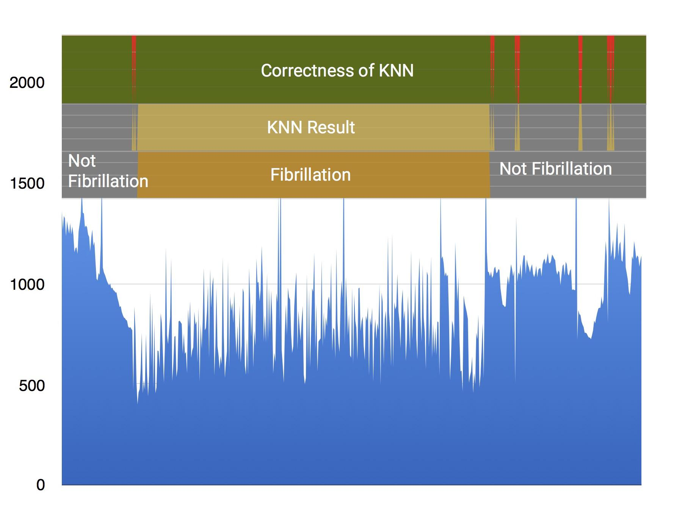

# SmartECG  

A system to detect fibrillations in athletes using a **heartbeat** sensor, like a heart rate monitor. The athletes is notified if he is affected by **atrial fibrillation**.

## Components
### Hardware
* STM32 Nucleo F401RE board
* Pulse sensor
* Bluetooth module X-NUCLEO-IDB05A1

### Software
* Arduino IDE
* Android Studio

### Architecture
  

### Connections
**STM32 Nucleo board connected to the pulse sensor and the bluetooth module**
  

## How does SmartECG work
The STM32 Nucleo board detects heartbeats through the pulse sensor. They are pre-processed and sent via bluetooth to the android application.
The pre-processed heartbeats are submitted to a machine learning algorithm. The android application notify the user when it is affected by atrial fibrillation

### Heartbeat pre-processing
The heartbeats are pre-processed by obtaining five values that will be submitted to the machine learning algorithm:

1. The average of the last three beats
1. The last beat
1. The second to last beat
1. The third to last beat
1. The average of the ten beats

### The machine learning algorithm
The Machine Learning algorithm used is [K-nearest neighbor](https://en.wikipedia.org/wiki/K-nearest_neighbors_algorithm).  

The accuracy of prediction is 94% - 97%.
  

## Code
* [STM Nucleo-F401RE Board](./Nucleo)  
* [Android application](./Android)  

## Android application

**User profile creation**  
 

**Connection to a bluetooth device**  

**The home screen shows the BPM (beats-per-minute) and sends a notification when fibrillation is detected**  
  

## How to compile the code
In order to to compile the code for the Nucleo Board you have to add STM32 boards support to Arduino IDE.  
You can find the tutorial at this link: https://github.com/stm32duino/wiki/wiki/Getting-Started

## Links

### Presentation on Slideshare  
* https://www.slideshare.net/DarioLitardi/presentazione-finale-99931764

### LinkedIn contacts
* [Andrea Lisanti](https://www.linkedin.com/in/andrea-lisanti)  
* [Dario Litardi](https://www.linkedin.com/in/dario-litardi-84851915b/)  
* [David Buscema](https://www.linkedin.com/in/david-buscema)

### Other useful links
* [STM32 Nucleo-F401RE](http://www.st.com/en/evaluation-tools/nucleo-f401re.html)  
* [X-Nucleo-IDB04A1](http://www.st.com/en/ecosystems/x-nucleo-idb04a1.html)  
* [Pulse sensor](https://pulsesensor.com/)