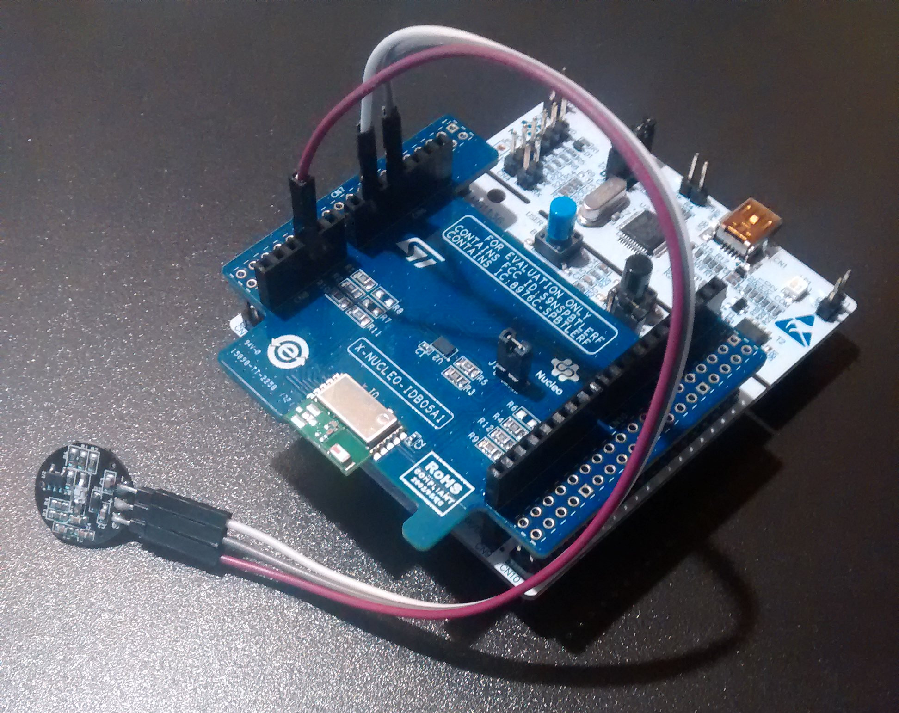
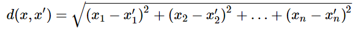
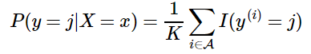
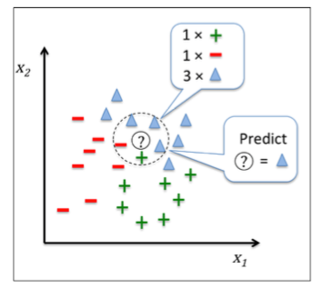
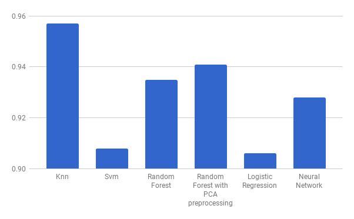
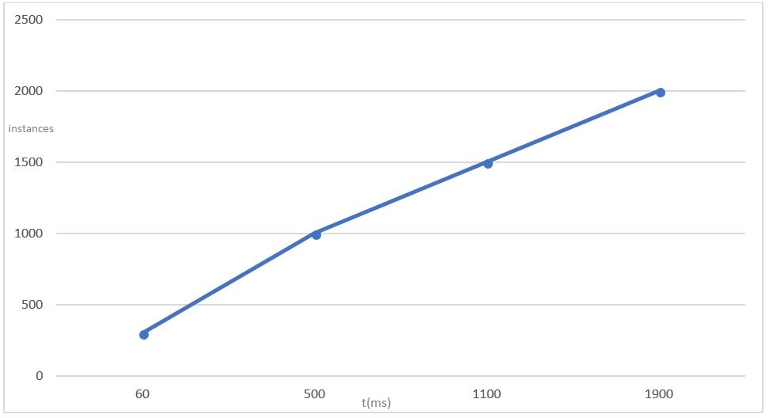
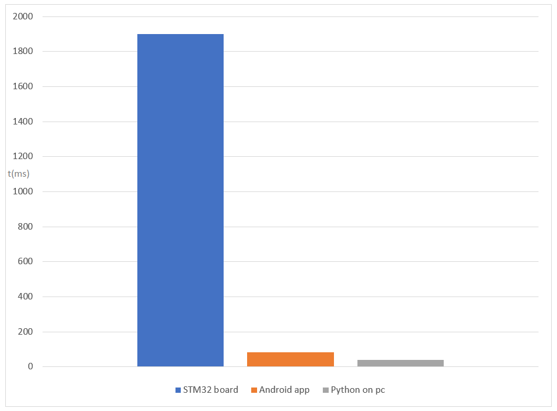
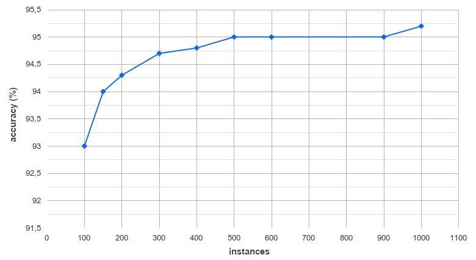
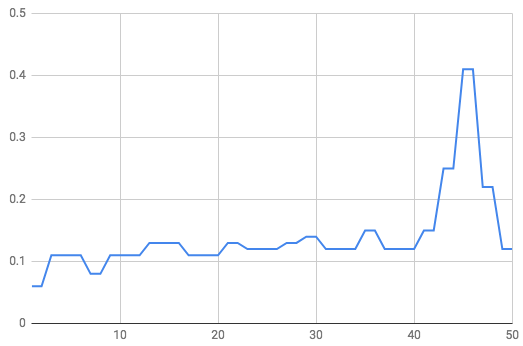
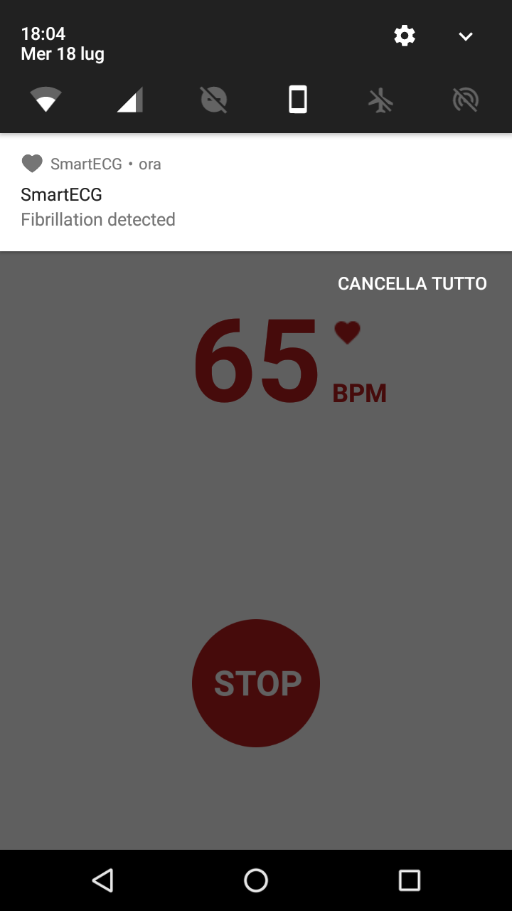

# SmartECG  

A system to detect fibrillations using a **heartbeat** sensor, like a heart rate monitor. The user is notified if he is affected by **atrial fibrillation**.
Atrial fibrillation is an abnormal heart rhythm characterized by **rapid and irregular beating** of the atria. Often it starts as brief periods of abnormal beating which become longer and possibly constant over time.

## Components
### Hardware
* STM32 Nucleo F401RE board
* Pulse sensor
* Bluetooth module X-NUCLEO-IDB05A1

### Software
* Arduino IDE
* Android Studio

### Architecture
  

### Connections
**STM32 Nucleo board connected to the pulse sensor and the bluetooth module**  

## How does SmartECG work
The STM32 Nucleo board detects heartbeats through the pulse sensor. They are pre-processed and then elaborated from a machine learning algorithm. 
The result is sent via Bluetooth to the android application that shows the BPM (beats-per-minute) in the main screen and notify the user when it is affected by atrial fibrillation. The Machine Learning algorithm used is KNN.

### How does KNN work?
In the classification setting, the K-nearest neighbor algorithm essentially boils down to forming a majority vote between the K most similar instances to a given “unseen” observation. Similarity is defined according to a distance metric between two data points. A popular choice is the Euclidean distance given by

  
 
but other measures can be more suitable for a given setting and include the Manhattan, Chebyshev and Hamming distance.

More formally, given a positive integer K, an unseen observation x and a similarity metric d, KNN classifier performs the following two steps:

It runs through the whole dataset computing d between x and each training observation. We’ll call the K points in the training data that are closest to x the set A. Note that K is usually odd to prevent tie situations.

It then estimates the conditional probability for each class, that is, the fraction of points in A with that given class label. (Note I(x) is the indicator function which evaluates to 1 when the argument x is true and 0 otherwise)

  

Finally, our input x gets assigned to the class with the largest probability.

In this project, the KNN algorithm is implemented on the STM32 Nucleo board.

The KNN memorizes the training dataset, indeed it doesn't learn a discriminative function from the training data as the traditional machine learning algorithm. This sometimes makes KNN much more efficient in circumstances where traditional algorithms fail.
All the dataset is stored inside the STM32-board in a double array in memory. The board then always do comparisons between the new data received from the sensor, and its internal dataset. The KNN implemented on the board uses the Euclidean distance as distance metric to determine the correct result. 

The KNN algorithm can be summarized by the following steps: 
1. Choose the number of k and a distance metric. 
1. Find the k nearest neighbors of the sample that we want to classify.
1. Assign the class label by majority vote. 

The picture illustrates how a new data point “?” is assigned to the triangle class label based on majority voting among its k nearest neighbors. In the example K = 5.

The dataset we used has been preprocessed according to the procedures described in the following article:

*Mar, T., Zaunseder, S., Martinnez, J. P., Llamedo, M., & Poll, R. (August 01, 2011). Optimization of ECG Classification by Means of Feature Selection. Ieee Transactions on Biomedical Engineering, 58, 8, 2168-2177.*

As stated in the article every instance is represented by a vector of five values, each with a class label. 

The values of the input vector:

1. The average of the last three beats
1. The last beat
1. The second to last beat
1. The third to last beat
1. The average of the last ten beats  

The class label:  
1 in case in fibrillation, 0 otherwise  

The first instances of our dataset:  

| Input vector | Class label |
|:---------|:------|
| {926.6666666666666, 1132.0, 708.0, 940.0, 894.8} | 0 |
| {418.6666666666667, 472.0, 404.0, 380.0, 444.4}| 1 |
| {938.6666666666666, 928.0, 932.0, 956.0, 924.0} | 0 |
| {685.3333333333334, 752.0, 652.0, 652.0, 707.6} | 1 |
| {909.3333333333334, 892.0, 916.0, 920.0, 892.0} | 0 |
| {838.6666666666666, 828.0, 840.0, 848.0, 841.2} | 0 |
| {881.3333333333334, 872.0, 884.0, 888.0, 882.8} | 0 |
| {593.3333333333334, 748.0, 472.0, 560.0, 538.8} | 1 |

In the SMT32 board, to classify a new instance we evaluate the input values and then the KNN returns the class label.

#### Trainingset
We need these values because fibrillation is detected only when the intervals between two beats corresponding to the electrical activation of the ventricles are completely irregular without following a repetitive pattern.

The choice to use the KNN is due to the excellent accuracy compared to others machine learning algorithm. We compared different machine learning algorithms writing a script in Python (available at this [link](py/script.py)) It uses the [scikit-learn library](http://scikit-learn.org/stable/index.html). 

Below is a list of all the machine learning algorithms tested with the results obtained:

| Algorithm | Accuracy |
|:----------|:------|
| KNN       | 0.957 |
| SVM       | 0.908 |
| Random Forest | 0.935 |
| Random Forest with PCA preprocessing | 0.941 |
| Logistic Regression | 0.907 |
| Neural Network | 0.928 |  

  

Chart of the comparison between the accuracies of the tested algorithms  

As we can see from the graph, the KNN achieves the best results.  
The accuracy of prediction is always between 94% and 97%.

## Code
* [STM Nucleo-F401RE Board](./Nucleo)  
* [Android application](./Android)  

## Correctness
We tested the KNN algorithm on several platforms and programming languages, such as Java with Weka library on the Android smartphone, C++ on STM32 board and Python, for demonstrating the correctness of our implementation.
We started from a unique and traditional dataset (https://archive.ics.uci.edu/ml/datasets/iris) and then we compared the accuracies of every implementation applying the KNN algorithm to this dataset.
The obtained result is that each implementation returns an accuracy approximately of the 97%. For this reason we can assert that the KNN implementation on the STM32 board is correct and reliable.

## Performance

We tested the KNN algorithm's performance in two ways. First of all we compared the execution times of the classification in milliseconds with the number of the instances of the dataset within STM32 board. At a later stage, we compared, using a fixed number of instances (2000), the execution times of the classification in several platforms such as STM32 board, Android application on the smartphone and Python on our pc. 

In the graph below we reported the first test: the execution times in milliseconds varying the number of the instances.  
   
Comparison between the number of the instances and the execution times on STM32 board.
     
    
The results of the second test are displayed in the chart below: the execution times in milliseconds changing the hardware platform. In this case the fixed number of the instances of the dataset is 2000. 

  

From the first test we can conclude that there is a direct proportionality between the number of the instances and the execution time. When the first one increases the latter increases as well.   
From the second test we can consider that the execution time corresponding to a high and fixed number of the instances (2000) within the STM32 board is far slower than the Android app and the Python implementation on pc. 

### Limitations

After we tested the computational performances, we analyzed the limitations of the performances on the STM32 board.
Regarding the space in memory, we obtained that with 2500 instances the Arduino IDE shows a warning at compile time: "Low memory available, stability problems may occur". Because of this issue we can use at most 2000 instances in the dataset for the KNN algorithm.  
Furthermore the algorithm with 2500 instances is very slow: after five minutes it doesn't return an output.  
We tested if there are limitations of the KNN algorithm implemented both in Android application and Python on pc. There are no limitations of space and times in these two platform: with the complete dataset of 3337 instances, in Android the algorithm takes for the classification approximately 90 milliseconds and in Python approximately 43 milliseconds.   

### Accuracy

For the choice of the platform, we tested the KNN algorithm on the STM32 board, Android app on the smartphone and Python on pc, comparing the accuracies of these implementations. Because of the correctness of these implementations, the accuracies for each number of the instances are equivalent in every platform (Android, STM32, Python). We report the result in the chart below.   

Comparison between the accuracy and the number of the instances valid in every platform

We can notice that increasing the number of the instances, the accuracy augments.  

**Comparing the accuracies and the performances, the best choice is the implementation on the STM32 board using 300 instances in the dataset.**

### Validation
A smart approach involves estimating the test error rate by holding out a subset of the training set from the fitting process. This subset, called the validation set, can be used to select the appropriate level of flexibility of our algorithm. There are different validation approaches that are used in practice, we used the k-fold cross validation.  
**k-fold cross validation** (the k is totally unrelated to K of the KNN) involves randomly dividing the training set into k groups, or folds, of approximately equal size. The first fold is treated as a validation set, and the method is fit on the remaining k−1 folds. The misclassification rate is then computed on the observations in the held-out fold. This procedure is repeated k times; each time, a different group of observations is treated as a validation set. This process results in k estimates of the test error which are then averaged out.
Cross-validation can be used to estimate the test error associated with a learning method in order to evaluate its performance, or to select the appropriate level of flexibility. 
We have tested k-fold cross validation and plotted the result in the chart below.  

10-fold cross validation tells us that K=1 results in the lowest validation error.   

## Android application

**User profile creation**  
 

**Connection to a bluetooth device**  

**The home screen shows the BPM (beats-per-minute)**  
  

**The notification received when the fibrillation is detected**  
  

## How to compile the code
In order to compile the code for the Nucleo Board you have to add STM32 boards support to Arduino IDE.  
You can find the tutorial at this link: https://github.com/stm32duino/wiki/wiki/Getting-Started

## Video demonstrations
1. [Simulation of the atrial fibrillation](https://www.youtube.com/watch?v=Bsk9MxrTc6Y)  
1. [State of rest](https://www.youtube.com/watch?v=YJYAtLwRzp4)  
1. [Running test](https://www.youtube.com/watch?v=_6s1PGl-Tb8)  

Battery used to do the tests.

## Links

### Presentation on Slideshare  
* https://www.slideshare.net/DarioLitardi/presentazione-finale-102892504

### LinkedIn contacts
* [Andrea Lisanti](https://www.linkedin.com/in/andrea-lisanti)  
* [Dario Litardi](https://www.linkedin.com/in/dario-litardi-84851915b/)  
* [David Buscema](https://www.linkedin.com/in/david-buscema)

### Other useful links
* [STM32 Nucleo-F401RE](http://www.st.com/en/evaluation-tools/nucleo-f401re.html)  
* [X-Nucleo-IDB04A1](http://www.st.com/en/ecosystems/x-nucleo-idb04a1.html)  
* [Pulse sensor](https://pulsesensor.com/)

